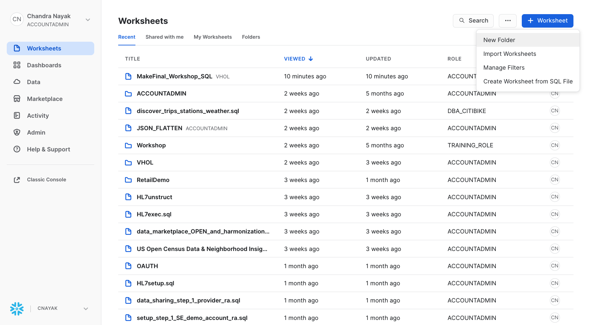
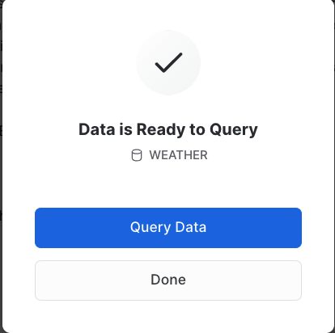
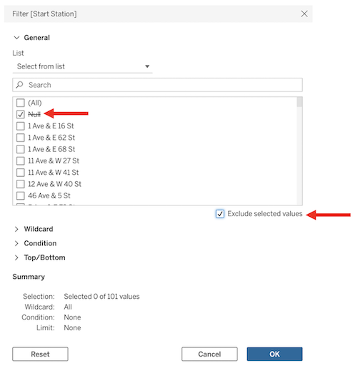
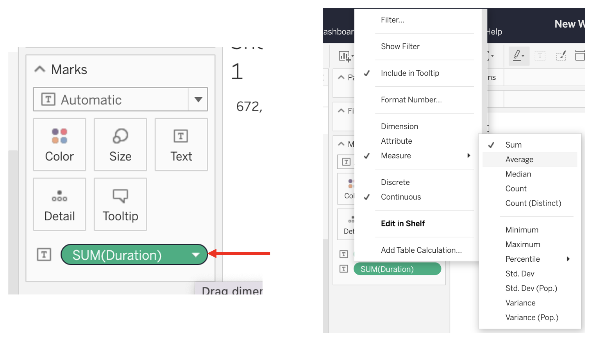
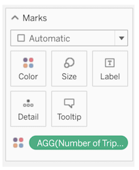

author: Chandra Nayak & Bailey Ferrari 
id: visual_analytics_powered_by_snowflake_and_tableau
summary: Visual Analytics Powered by Snowflake and Tableau
categories: Getting Started
environments: web
status: Published 
feedback link: https://github.com/Snowflake-Labs/sfguides/issues
tags: Getting Started, Data Science, Data Engineering, Twitter 

# Visual Analytics powered by Snowflake and Tableau
<!-- ------------------------ -->
## Overview 
Duration: 90

Join Snowflake and Tableau for an instructor-led hands-on lab to build governed, visual, and interactive analytics quickly and easily. 


The rest of this Snowflake Guide explains the steps of writing your own guide. 

### Prerequisites
- Familiarity with Snowflake and Tableau

### What You’ll Learn 
- Load unstructured data from IoT enabled bikes into Snowflake.
- Integrate and deliver multi-tenant tables and views in Snowflake to Tableau for real-time dashboarding.
- Use API integration to load geospatial data into Snowflake. 
- Securely connect to your Snowflake data by leveraging Virtual Connections and Centralized Row Level Security in Tableau.
- Build visual, intuitive, and interactive data visualizations powered by live data in Snowflake.
- Share production-ready Tableau dashboards by embedding the visualizations into your custom application.
- Showcase your data in the Snowflake Data Marketplace


### What You’ll Need 
- A [Snowflake](https://trial.snowflake.com/) Account 
- A [Tabelau Server Online](https://www.tableau.com/products/online/request-trial) Account  


### What You’ll Build 
- Tableau Dashboard to present demand for cycles correlated with Weather

<!-- ------------------------ -->
## Snowflake Configuration
Duration: 5
1. Create a Snowflake Multi-cluster Trial account 

2. Login to your Snowflake Trial account

3. We will be using the new UI to get started but you can also switch over to the Classic Console if you would like. 

Classic UI: 
If you ever want to change from the new UI to the classic one, click on the home button and then Classic Console.


### New Login UI


<!-- ------------------------ -->
## Tableau Configuration
Duration: 2
1. Login to your Tableau Online Trial account
 

<!-- ------------------------ -->

## Managing Unstructured Data
Duration: 2

### Download Demo SQL Script  
[Download workload.sql & Create Worksheet from SQL File](https://github.com/mcnayak/sfquickstarts/blob/master/site/sfguides/src/visual_analytics_powered_by_snowflake_and_tableau/assets/MakeFinal_Workshop.sql).



### Create Snowflake Objects

``` sql 
-- Create Database, Schema and Warehouse
create or replace database VHOL_DATABASE;
use database VHOL_DATABASE;

create or replace schema  VHOL_DATABASE.VHOL_SCHEMA;
use schema  VHOL_SCHEMA;


create or replace warehouse VHOL_WH WITH 
    WAREHOUSE_SIZE = 'MEDIUM' 
    WAREHOUSE_TYPE = 'STANDARD' 
    AUTO_SUSPEND = 60 
    AUTO_RESUME = TRUE 
    MIN_CLUSTER_COUNT = 1 
    MAX_CLUSTER_COUNT = 1 
    SCALING_POLICY = 'STANDARD';
  
-- Change Compute Size Instantly 
alter warehouse VHOL_WH SET WAREHOUSE_SIZE = 'LARGE';

alter warehouse VHOL_WH SET WAREHOUSE_SIZE = 'MEDIUM';

```

### Create Stage for hosting files
```sql
create or replace STAGE VHOL_STAGE;

show stages;

--External Stage on S3
create or replace STAGE VHOL_STAGE
    URL = 's3://snowflake-workshop-lab/citibike-trips/json';

--Lists Files on the S3 Bucket
list @VHOL_STAGE/;

CREATE FILE FORMAT "JSON" TYPE=JSON COMPRESSION=GZIP;

show File Formats;
```

### Query JSON Data
``` sql
-- Query individual columns from first 100 rows 
select $1, $2, $3, $4, $5, $6, $7, $8, $9, $10, $11, $12, $13, $14, $15, $16
from @VHOL_STAGE/2016-08-01/data_01a304b5-0601-4bbe-0045-e8030021523e_005_6_0.json.gz limit 100;

-- Query all columns from a single row
SELECT * FROM @VHOL_STAGE/2016-08-01/data_01a304b5-0601-4bbe-0045-e8030021523e_005_6_0.json.gz (file_format=>JSON)  limit 1;

-- Create a table with Variant column
create or replace table vhol_trips
  (tripid number autoincrement, 
   v variant)
  change_tracking = true;

-- Load JSON data into Variant column
copy into vhol_trips (v) from 
  (SELECT * FROM @VHOL_STAGE/2016-08-01/data_01a304b5-0601-4bbe-0045-e8030021523e_005_6_0.json.gz (file_format=>JSON));
```

### Build Relational Views on JSON
``` sql 

--- Extract JSON data as relational columns
create or replace view vhol_trips_vw 
  as select 
    tripid,
    v:STARTTIME::timestamp_ntz starttime,
    v:ENDTIME::timestamp_ntz endtime,
    datediff('minute', starttime, endtime) duration,
    v:START_STATION_ID::integer start_station_id,
    v:END_STATION_ID::integer end_station_id,
    v:BIKE.BIKEID::string bikeid,
    v:BIKE.BIKE_TYPE::string bike_type,
    v:RIDER.RIDERID::integer riderid,
    v:RIDER.FIRST_NAME::string || ' ' || v:RIDER.LAST_NAME::string rider_name,
    to_date(v:RIDER.DOB::string, 'YYYY-MM-DD') dob,
    v:RIDER.GENDER::string gender,
    v:RIDER.MEMBER_TYPE::string member_type,
    v:RIDER.PAYMENT.TYPE::string payment,
    ifnull(v:RIDER.PAYMENT.CC_TYPE::string, 
      v:RIDER.PAYMENT.PHONE_TYPE::string) payment_type,
    ifnull(v:RIDER.PAYMENT.PHONE_NUM::string,
      v:RIDER.PAYMENT.CC_NUM::string) payment_num
  from vhol_trips;

-- avg trip duration 
select date_trunc('hour', starttime) as "date",
count(*) as "num trips",
avg(duration)/60 as "avg duration (mins)" 
from vhol_trips_vw
group by 1 order by 1;

--trips by day
select
    dayname(starttime) as "day of week",
    count(*) as "num trips"
from vhol_trips_vw
group by 1 order by 2 desc;

``` 

### 
<!-- ------------------------ -->
## DevOps in Snowflake

### Clone Table
``` sql 
create table vhol_trips_dev clone vhol_trips;

select * from vhol_trips_dev limit 1;
```
### Drop and Undrop Table
``` sql
drop table vhol_trips_dev; 

select count(*) from vhol_trips_dev limit 1;

--thank god for resurrection
undrop table vhol_trips_dev;

select count(*) from vhol_trips_dev limit 1;

```
<!-- ------------------------ -->

<!-- ------------------------ -->
## Add Weather Data from Snowflake Marketplace

### Click on Data Marketplace and type WEATHER in Search Snowflake Marketplace toolbar


### Set database name to WEATHER, grant access to PUBLIC role


### Data Ready to Query 



### Convert Kelvin to Celcius
``` sql
-- UDF to convert Kelvin to Celcius
create or replace function degFtoC(k float)
returns float
as
$$
  truncate((k - 32) * 5/9, 2)
$$; 

```
###

### Query Weather data
``` sql
desc view weather.standard_tile.history_day;

-- Is there rain in the forecast that may impact cycling in a specific area 
SELECT COUNTRY,DATE_VALID_STD,TOT_PRECIPITATION_IN,tot_snowfall_in AS SNOWFALL,  POSTAL_CODE, DATEDIFF(day,current_date(),DATE_VALID_STD) AS DAY, HOUR(TIME_INIT_UTC) AS HOUR  FROM WEATHER.STANDARD_TILE.FORECAST_DAY WHERE POSTAL_CODE='32333' AND DAY=7;
```
### Is there precipitation or snowfall in NY zipcodes
``` sql
create or replace view vhol_weather_vw as
  select 'New York'                                   state,
    date_valid_std                                    observation_date,
    doy_std                                           day_of_year,
    avg(min_temperature_air_2m_f)                     temp_min_f,
    avg(max_temperature_air_2m_f)                     temp_max_f,
    avg(avg_temperature_air_2m_f)                     temp_avg_f,
    avg(degFtoC(min_temperature_air_2m_f))            temp_min_c,
    avg(degFtoC(max_temperature_air_2m_f))            temp_max_c,
    avg(degFtoC(avg_temperature_air_2m_f))            temp_avg_c,
    avg(tot_precipitation_in)                         tot_precip_in,
    avg(tot_snowfall_in)                              tot_snowfall_in,
    avg(tot_snowdepth_in)                             tot_snowdepth_in,
    avg(avg_wind_direction_100m_deg)                  wind_dir,
    avg(avg_wind_speed_100m_mph)                      wind_speed_mph,
    truncate(avg(avg_wind_speed_100m_mph * 1.61), 1)  wind_speed_kph,
    truncate(avg(tot_precipitation_in * 25.4), 1)     tot_precip_mm,
    truncate(avg(tot_snowfall_in * 25.4), 1)          tot_snowfall_mm,
    truncate(avg(tot_snowdepth_in * 25.4), 1)         tot_snowdepth_mm
  from weather.standard_tile.history_day
  where postal_code in ('10257', '10060', '10128', '07307', '10456')
  group by 1, 2, 3;
  
select * from vhol_weather_vw limit 10;

```
<!-- ------------------------ -->

<!-- ------------------------ -->
## Enrich with Geospatial Station Data 
We just have station_id, so let's get geospatial data to locate those stations on map

###  Access data from AWS API Gateway
``` sql  
-- Integration to AWS API Gateway 
create or replace api integration fetch_http_data
  api_provider = aws_api_gateway
  api_aws_role_arn = 'arn:aws:iam::148887191972:role/ExecuteLambdaFunction'
  enabled = true
  api_allowed_prefixes = ('https://dr14z5kz5d.execute-api.us-east-1.amazonaws.com/prod/fetchhttpdata');

```

``` sql 
-- External Function call to Lambda to download data 

create or replace external function fetch_http_data(v varchar)
    returns variant
    api_integration = fetch_http_data
    as 'https://dr14z5kz5d.execute-api.us-east-1.amazonaws.com/prod/fetchhttpdata';

```
###

### Flatten JSON data received from API's

Geospatial data is available in a nested json array, let's flatten that 

``` sql 
-- use lateral flatten function to flatten nested JSON
create or replace table vhol_spatial_data as
with gbfs as (
  select $1 type, 
     fetch_http_data($2) payload
  from (values
    ('region', 'https://gbfs.citibikenyc.com/gbfs/en/system_regions.json'),
    ('station', 'https://gbfs.citibikenyc.com/gbfs/en/station_information.json'),
    ('neighborhood', 'https://snowflake-demo-stuff.s3.amazonaws.com/neighborhoods.geojson'))
  )
  select type, value v
    from gbfs, lateral flatten (input => payload:response.data.regions)
    where type = 'region'
  union all
  select type, value v
    from gbfs, lateral flatten (input => payload:response.data.stations)
    where type = 'station'
  union all
  select type, value v
    from gbfs, lateral flatten (input => payload:response.features)
    where type = 'neighborhood';
    
    
    select * from vhol_spatial_data;
  ```

###

<!-- ------------------------ -->

<!-- ------------------------ -->
## Correlate Trips, Weather and Geospatial Data

### Combine station data with geospatial data
``` sql 
create or replace table vhol_stations as with 
  -- extract the station data
    s as (select 
        v:station_id::number station_id,
        v:region_id::number region_id,
        v:name::string station_name,
        v:lat::float station_lat,
        v:lon::float station_lon,
        st_point(station_lon, station_lat) station_geo,
        v:station_type::string station_type,
        v:capacity::number station_capacity,
        v:rental_methods rental_methods
    from vhol_spatial_data
    where type = 'station'),
    -- extract the region data
    r as (select
        v:region_id::number region_id,
        v:name::string region_name
    from vhol_spatial_data
    where type = 'region'),
    -- extract the neighborhood data
    n as (select
        v:properties.neighborhood::string nhood_name,
        v:properties.borough::string borough_name,
        to_geography(v:geometry) nhood_geo
    from vhol_spatial_data
    where type = 'neighborhood')   
-- join it all together using a spatial join
select station_id, station_name, station_lat, station_lon, station_geo,
  station_type, station_capacity, rental_methods, region_name,
  nhood_name, borough_name, nhood_geo
from s inner join r on s.region_id = r.region_id
       left outer join n on st_contains(n.nhood_geo, s.station_geo);

-- query station data 
select * from vhol_stations;
``` 

### Combine Trips, Geospatial and Stations 

Let's combine trip data with geospatial to identify popular routes
```sql
create or replace view vhol_trips_stations_vw as (
  with
    t as (select * from vhol_trips_vw),
    ss as (select * from vhol_stations),
    es as (select * from vhol_stations)
  select 
    t.tripid, 
    starttime, endtime, duration, start_station_id,
    ss.station_name start_station, ss.region_name start_region,
    ss.borough_name start_borough, ss.nhood_name start_nhood, 
    ss.station_geo start_geo, ss.station_lat start_lat, ss.station_lon start_lon,
    ss.nhood_geo start_nhood_geo, 
    end_station_id, es.station_name end_station, 
    es.region_name end_region, es.borough_name end_borough, 
    es.nhood_name end_nhood, es.station_geo end_geo, 
    es.station_lat end_lat, es.station_lon end_lon,
    es.nhood_geo end_nhood_geo,
    bikeid, bike_type, dob, gender, member_type, payment, payment_type, payment_num
  from t 
    left outer join ss on start_station_id = ss.station_id
    left outer join es on end_station_id = es.station_id); 

```

###  

### Combine Trip, Geospatial, Stations and Weather data
```sql 
create or replace view vhol_trips_stations_weather_vw as (
  select t.*, temp_avg_c, temp_avg_f,
         wind_dir, wind_speed_mph, wind_speed_kph
  from vhol_trips_stations_vw t 
       left outer join vhol_weather_vw w on date_trunc('day', starttime) = observation_date);


-- let's query the integrated data view
select * from vhol_trips_stations_vw limit 200;
select * from vhol_trips_stations_weather_vw limit 200;

```

###

### 

<!-- ------------------------ -->

<!-- ------------------------ -->
## Secure Data Sharing
```  sql
create or replace table tenant (
    tenant_id number,
    tenant_description string,
    tenant_account string
);

--add tenant for your account
insert into tenant values (
    1, 'My Account', current_account()
);

--select
select * from tenant;

--map tenant to subscribed station beacons
create or replace table tenant_stations (
    tenant_id number,
    station_id number
);

--values
insert into tenant_stations values
    (1, 212),
  (1, 216),
  (1, 217),
  (1, 218),
  (1, 223),
  (1, 224),
  (1, 225),
  (1, 228),
  (1, 229),
  (1, 232),
  (1, 233),
  (1, 236),
  (1, 237),
  (1, 238),
  (1, 239),
  (1, 241),
  (1, 242),
  (1, 243),
  (1, 244),
  (1, 245),
  (1, 247),
  (1, 248),
  (1, 249),
  (1, 250),
  (1, 251),
  (1, 252),
  (1, 253),
  (1, 254),
  (1, 255),
  (1, 257),
  (1, 258),
  (1, 259),
  (1, 260),
  (1, 261),
  (1, 262),
  (1, 263),
  (1, 264),
  (1, 265),
  (1, 266),
  (1, 267),
  (1, 268),
  (1, 270),
  (1, 271),
  (1, 274),
  (1, 275),
  (1, 276),
  (1, 278),
  (1, 279),
  (1, 280),
  (1, 281),
  (1, 282),
  (1, 284),
  (1, 285),
  (1, 289),
  (1, 290),
  (1, 291),
  (1, 293),
  (1, 294),
  (1, 295),
  (1, 296),
  (1, 297),
  (1, 298)
;

```

### Enabling Row Level Access Policy 
``` sql
--select *
select * from tenant_stations;

--select
set tenant_sv = '1';

select * from vhol_trips_vw
join tenant_stations
    on vhol_trips_vw.start_station_id = tenant_stations.station_id
join tenant
    on tenant_stations.tenant_id = tenant.tenant_id
where
    tenant.tenant_id = $tenant_sv
limit 100;

--select bogus
set tenant_sv = '0';

select * from vhol_trips_vw
join tenant_stations
    on vhol_trips_vw.start_station_id = tenant_stations.station_id
join tenant
    on tenant_stations.tenant_id = tenant.tenant_id
where
    tenant.tenant_id = $tenant_sv
limit 100;

```

### Create Secure Objects to Share 
``` sql 
--secure view
create or replace secure view  vhol_trips_secure as
(select --tripduration, 
 starttime, endtime, start_station_id, bikeid, tenant.tenant_id from vhol_trips_vw
join tenant_stations
    on vhol_trips_vw.start_station_id = tenant_stations.station_id
join tenant
    on tenant_stations.tenant_id = tenant.tenant_id
where
    tenant.tenant_account = current_account());

--current account?
select current_account();

--select secure view

select * from vhol_trips_secure limit 100;

```

### Create Reader Account 
``` sql
--create a reader account for your tenant


CREATE MANAGED ACCOUNT IMP_CLIENT
    admin_name='USER',
    admin_password='P@ssword123',
    type=reader,
    COMMENT='Testing'; -- Take a note of the Account Name and the URL 

--add tenant for your big important client via a reader account
insert into tenant values (
    1, 'Big Important Client, Wink Wink', 'IMP_CLIENT'
);

--simulate your tenant
alter session set simulated_data_sharing_consumer = 'IMP_CLIENT';

--select secure view as your tenant
select * from vhol_trips_secure limit 100;

--unsimulate your tenant
alter session unset simulated_data_sharing_consumer;

--are you sure?
select count(*) from vhol_trips_secure;
```

### Grant Share Access to Reader 
``` sql 
--create share and share to reader account
CREATE OR REPLACE SHARE VHOL_SHARE COMMENT='Creating my Share to Share with my Reader';
GRANT USAGE ON DATABASE VHOL_DATABASE TO SHARE VHOL_SHARE;
GRANT USAGE ON SCHEMA VHOL_SCHEMA TO SHARE VHOL_SHARE;
GRANT SELECT ON VIEW VHOL_TRIPS_SECURE TO SHARE VHOL_SHARE;
DESC SHARE VHOL_SHARE;

show managed accounts; 
--take note of account_locator
SELECT "locator" FROM TABLE (result_scan(last_query_id(-1))) WHERE "name" = 'IMP_CLIENT';
--Replace with your locator for 'IMP_CLIENT' from above step
set account_locator='JPA70732'; 
ALTER SHARE VHOL_SHARE ADD ACCOUNT = $account_locator;
SHOW SHARES LIKE 'VHOL_SHARE';

-- take note of reader account url with credentials from CREATE MANAGED account statement
show managed accounts;
select  $6 as URL FROM table (result_scan(last_query_id())) WHERE "name" = 'IMP_CLIENT';

```

###

<!-- ------------------------ -->

<!-- ------------------------ -->

## Consumer Access Data

[Download reader_query.sql & Create Worksheet from SQL File](https://github.com/mcnayak/sfquickstarts/blob/master/site/sfguides/src/visual_analytics_powered_by_snowflake_and_tableau/assets/reader_query.sql)
``` sql
-- create database from share in the reader account  
CREATE DATABASE TRIPSDB FROM SHARE 
create or replace warehouse VHOL_READER WITH 
    WAREHOUSE_SIZE = 'XSMALL' 
    WAREHOUSE_TYPE = 'STANDARD' 
    AUTO_SUSPEND = 60 
    AUTO_RESUME = TRUE 
    MIN_CLUSTER_COUNT = 1 
    MAX_CLUSTER_COUNT = 1 
    SCALING_POLICY = 'STANDARD';
    

    

USE DB TRIPSDB
USE SCHEMA VHOL_SCHEMA; 

SELECT * FROM VHOL_SCHEMA.VHOL_TRIPS_SECURE;

```


[Download reader_query.sql & Create Worksheet from SQL File](https://github.com/mcnayak/sfquickstarts/blob/master/site/sfguides/src/visual_analytics_powered_by_snowflake_and_tableau/assets/reader_query.sql)
``` sql
-- create database from share in the reader account  
CREATE DATABASE TRIPSDB FROM SHARE 
create or replace warehouse VHOL_READER WITH 
    WAREHOUSE_SIZE = 'XSMALL' 
    WAREHOUSE_TYPE = 'STANDARD' 
    AUTO_SUSPEND = 60 
    AUTO_RESUME = TRUE 
    MIN_CLUSTER_COUNT = 1 
    MAX_CLUSTER_COUNT = 1 
    SCALING_POLICY = 'STANDARD';
    
    

USE DB TRIPSDB
USE SCHEMA VHOL_SCHEMA; 

SELECT * FROM VHOL_SCHEMA.VHOL_TRIPS_SECURE;
```
<br>

<!-- ------------------------ -->

<!-- ------------------------ -->

<br>

## 1. Login to Tableau Online & Connect to Snowflake
Navigate to https://online.tableau.com/ and login to Tableau Online using your credentials.


<br>

On the Home page within the blue “Welcome to your Tableau site” banner, click into the “New” dropdown and select “Workbook”.


<br>

Within the “Connect to Data” popup window, select “Connectors”. Find *Snowflake* in the grid. Note: you may need to use the horizontal bottom scroll-bar and scroll to the right of the “Connections" tab.


<br>

Enter the Server name. Change Authentication to “Username and Password”, enter your login credentials, then click the blue “Sign in” button.


<br>

Within the connections pane, make the following selections:
* Warehouse: VHOL_WH
* Database: VHOL_DATABASE
* Schema: VHOL_Schema

A list of tables should appear below.


<br>

Hover over the border of the Connections pane window until a black icon appears, then drag the “Connections” window to the right to make it wider. 

Widen the pane until you can read the full table names.


<br>

Scroll down in the list of available tables until you find a table called “VHOL_Trips_Stations_VW”. Drag that table out onto the main section of the screen, where it says “Drag tables here”.


<br>

<!-- ------------------------ -->

<!-- ------------------------ -->

<br>

## 2. Configure Data Source Filters
By adding data source filters, we can exclude any outliers that may hinder performance or skew our data. We are going to be adding 3 data source filters total. 

In the top right corner of the screen, locate where it says “Filters”. Under “Filters”, there is a button that says “Add”. Click the “Add” button.


<br>

On the bottom left of the pop-up “Edit Data Source Filters” window, click “Add Filter”.  


<br>

Within the pop-up, start typing “Start Station”. Click the “Start Station” field. 


<br>

When the list of Station Names appear, click “Null”, then click “Exclude selected values”. After that, click the blue “Ok” button in the bottom right of the pop-up.



<br>

Repeat these steps for “End Station”; Add Filter → search “End Station” → click Null → Exclude selected values → Ok. 


<br>

Lastly, repeat the same steps steps for “Start Nhood”; Add Filter → search “Start Nhood” → click Null → Exclude selected values → Ok. 


<br>

All 3 Data Source filters should appear within the “Edit Data Source Filters” window, and the “Details” column of the table confirms we are excluding Nulls. Once you’ve confirmed the data source filters have been set correctly, click the blue “Ok” button in the bottom right of the “Edit Data Source Filters” window.


<br>

We have successfully filtered out incomplete trips or trips without a documented starting neighborhood.

<br>

<!-- ------------------------ -->

<!-- ------------------------ -->

<br>

## 3. Build Sheet 1: KPIs

Now we are ready to visualize our data! In the bottom left of the screen, click “Sheet 1”.


<br>

Let’s start by creating a simple calculation to count the number of trips in our data set. In the upper toolbar, locate the “Analysis” tab. Within the “Analysis” dropdown, click “Create Calculated Field...”


<br>

Rename the field from “Calculation 1” to “Number of Trips”. Click into the blank calculation window below. 

Once a flashing cursor appears, type:

```
CountD([Tripid])
```

<br>

Click the blue “OK” button on the bottom right of the calculated field window.  Congratulations, you’ve added a new field to the dataset!

Locate the new Number of Trips field within the left Data pane. Immediately after you close the calculated field window, the new “Number of Trips” field will be highlighted in green. 


<br>

When a field is green in Tableau, it means it is a quantifiable metrics or aggregate (in this case, a distinct count).

Click and drag the “Number of Trips” field into the workspace, where it says “drop field here".


<br>

We now have our first KPI! Let’s add a few more KPIs into our view! 

Navigate back to the Data pane on the left and locate the “Duration” field. Click and drag that field onto the “Text” icon within the Marks card. 


<br>

You’ll notice the default aggregation is SUM(). In this case, we don’t want to sum this data point. Fortunately, Tableau makes it easy to alter the aggregation type. Simply hover over the green SUM(Duration) field within the Marks card until an arrow appears in the right corner of the field. Click that arrow to open a drop-down menu and change “Measure” from Sum to *Average*.



<br>

Another thing you will notice is that these KPI’s have no clear field names and are stacked on top of one another. While everyone will have their own personal preference, I’d personally much rather see the values side-by-side. 

To quickly restructure the view, click the “Show Me” icon located at the top right of the screen. Select “Text Table”, or the first option that appears in the grid. 


<br>

By changing the view into a Text Table, we told Tableau to add a new field, “Measure Names”, into our view. Tableau dropped “Measure Names” on *Rows*. 

Visible field names help me understand what I am seeing, but I would still rather see my values side-by-side as opposed to stacked. To restructure to view, simply click on the blue “Measure Names” field on *Rows* and drag it up a few millimeters to *Columns.* Make sure to release when the orange arrow appears within the Columns shelf.


<br>

Let’s add one more KPI to this view before moving on. Although we already used the “Duration” field to find the *average* trip time in minutes, we can use the same field more than once to highlight other interesting data points.

Find the original “Duration” field within the Data pane on the left. Click and drag that field onto the the new “Measure Values” card located below the “Marks” card. 
Note: This was created alongside “Measure Names” when we changed the view into a Text Table.


<br>

This time let’s alter the default aggregation from Sum to Maximum. Hover over the newly added SUM(Duration) field until an arrow appears. Click that arrow to open a drop-down menu. In the drop-down menu, change “Measure” to *Maximum*.


<br>

Within this “Measure Values” card, we can also reorganize the order in which fields appear in our view. Let’s drag “AGG(Number of Trips) to the top of the list, making sure it is the first column in our Text Table.


<br>

Last but not least, let’s rename our sheet. On the bottom left of the screen, right click where it says “Sheet 1” and update the Sheet name to “KPIs”.


<br>

Before we move on, let’s save our work thus far. In the top left side of the screen, click the light blue “Publish” button. Let’s name the workbook “CitiBike Draft” and save it into our *Personal Space*, since it is still a work-in-progress.


<br>

<!-- ------------------------ -->

<!-- ------------------------ -->

<br>

## 4. Build Sheet 2: Map

When working in Tableau, think as sheets as parts of a whole. Sheets aren’t supposed to answer all of the questions you have about your data, they are simply chapters within a much larger book. Unless you only have one simple question about your data, you will need to create numerous sheets, which is what we are going to do now. 

On the bottom of the screen next to the newly renamed “KPIs” sheet, click the icon directly to the right. This will open a new, blank Worksheet for us: “Sheet 2”.


<br>

One of the many things that sets Tableau apart from its competitors are the mapping capabilities... and we have a lot of awesome spatial data to work with in this table.

We’ll begin by writing another calculation. As you did last time, locate the “Analysis” tab in the upper toolbar. Within the “Analysis” dropdown, click “Create Calculated Field...”.  

Change the name of the calculation from “Calculation1” to “Trip Journey”. Click into the blank calculation window below; once a flashing cursor appears, type:

```
MAKELINE([Start Geo],[End Geo])
```

<br>

This calculation is creating a line between the station a rider began the ride, and the station a rider ended their ride, effectively plotting the journey they made. 

Locate the new “Trip Journey” field within the left Data pane. Immediately after you close the calculated field window, Trip Journey will be highlighted in blue. When a field is blue in Tableau, it means it is a dimension or, in this case, a categorical geographic field.


<br>

Click and drag the Trip Journey field into the workspace, where it says “drop field here”. Tableau is going to spin for a moment here, but it shouldn’t take more than 45-60 seconds. Not only is this complex spatial data, but it’s the first time Tableau is indexing it or storing it in its cache — this initial ingestion step is the only time it will take this long to render.

Upon rendering, you’ll notice that Tableau not only automatically creates a map for us, but also plots a line between the start location and the end location.


<br>

If you hover over the map, you will notice that Tableau is grouping all of the trips together into one single Mark. By adding layers of detail, we can isolate each individual trip. 

The first Detail we will add is “Start Station”. Locate the “Start Station” field in the Data pane, and drag it onto the “Detail” icon within the Marks card. Tableau will spin for a bit, but it shouldn’t take more than 30-45 seconds to render.


<br>

Repeat the steps above with “End Station”. Locate the “End Station” field within the Data pane, then drag it onto Detail. Tableau will spin for a bit, but it shouldn’t take more than 30-45 seconds to render.

Now hover over any of the marks on the map. You will see we’ve effectively isolated the different trips, creating a mark for each journey.


<br>

<!-- ------------------------ -->

<!-- ------------------------ -->

## 5. Enhance the Map using Map Layers & Color

<br>

Now, we can add Map Layers. 

Locate the “Start Geo” field in the Data pane, and drag it into the view, directly on top of our existing map. You’ll notice a “Map Layers” icon appears in the top left corner of the Map. Drag the “Start Geo” field onto that button, making sure to release the field only when the Map Layers icon is highlighted in orange. 


<br>

Repeat this process with the “End Geo” field.


<br>

Let’s pause and assess our map. We now have a line representing the journey each rider took, a dot where they started, and a dot where they ended. 

To make our map more intuitive for end users, let’s customize it.

You’ll notice that within the Marks card, Tableau has isolated all three of our Map layers: Start Geo, End Geo, and Trip Journey.


<br>

We can reorder these layers via simple drag and drop.  Let’s move ”Start Geo“ above ”End Geo“. Click the ”Start Geo“ tab and drag it above the ”End Geo“ tab.


<br>

Now let's customize the “Start Geo” map layer to to help our brain process what we are seeing more effectively. Make sure you are in the “Start Geo” tab, then click the “Color” button within the “Start Geo” marks card. 

At the top of the “Color” pop-up, click the lightest of the three shades of blue. At the bottom of the “Color” pop-up within the “Halo” category, select the darkest of the three shades of blue. You will notice the marks on the map update in real time.


<br>

Next, let’s customize the “End Geo” map layer. Again, we will use “Color”. This time, it will help differentiate the starting point from the ending point. 

Click into the “End Geo” tab, then click the “Color” button within the marks card. At the top of the “Color” pop-up, click the lightest of the three shades of orange. At the bottom of the “Color” pop-up within the “Halo” category, select the darkest of the three shades of orange. Again, you will notice the marks on the map update in real time.


<br>

The last Mark Layer to customize is “Trip Journey”. Click into the “Trip Journey” tab, then click the “Color” button within the marks card. At the top of the “Color” pop-up, click the second to lightest shade of gray.


<br>

<!-- ------------------------ -->

<!-- ------------------------ -->

<br>

## 6. Change the Background Map and Background Layers

Our map has already come so far! Let's make a few more quick and easy changes. 

Within the top toolbar directly to the right of “Analysis”, click into the “Map” tab. 

Hover over the first option in the pop-up drop-down, “Background Maps”, and change the selection from “Light” to “Normal”. You’ll notice we now have color and shading to help us differentiate streets from water and landmarks.


<br>

Go back to the “Map” tab in the top toolbar. This time, click into “Background Layers...”. Tableau comes packaged with a wide variety of background map details for you to enable or disable as you choose. In our case, let’s add “Streets, Highways, Routes” to our view. Simply click that checkbox within the list.


<br>

Exit the “Background Layers” pane by clicking the “X” on the top right. Clicking this X will bring you back to the familiar Data pane.

Tada, our map is complete! 


<br>

Let’s rename this sheet “Map” before moving on. As you did when you renamed the first sheet, right click into the “Sheet 2” tab on the bottom left to rename it. Once you’ve renamed the sheet, save your changes before moving on by clicking the bright blue “Publish” button on the top right.


<br>

<!-- ------------------------ -->

<!-- ------------------------ -->

## 7. Build Sheet 3: Time

Let’s make one final sheet before pulling it all together into a dashboard. Click the icon directly to the right of the newly renamed “Map” sheet to open a blank worksheet for our final visualization.

For this visualization, let’s analyze the relationship between number of rides and time of day. 

Start by locating the “Starttime” field within the Data pane, then drag that field to *Columns*. 


<br>

You’ll notice that Tableau will auto-aggregate up to the yearly level. Much like the default aggregation to SUM within our KPIs, rolling up to “Year” may be helpful in some cases but it actually isn’t what we want here. 

To edit this, hover over the blue YEAR(Starttime) field on Columns appears in the right corner of the field. Click the arrow that appears to open a drop-down menu. 

A long pop-up with two _nearly_ identical sections appears. 


<br>

There are two ways to work with dates in Tableau: by using a DATEPART, or by using a DATEVALUE. DATEPARTS are dimensions, and DATEVALUES are measures. By selecting an option from the first section, you are telling Tableau that you want to use the date field as a categorical DATEPART. Alternatively, by selecting an option from the second section, you are telling Tableau that you want to use the date field as a continuous DATEVALUE.

In our case, we not only want to use a DATEPART, but we want to use a specialized datepart: Weekday. You can find this specialized DATEPART by hovering over the “More >” option within the first section, then selecting “Weekday” from the pop-up list.


<br>

When you exit the Starttime drop-down menu, you’ll see that the days of the week are listed horizontally.


<br>

Next, find the “Endtime“ field within the Data pane, and drag that field onto *Rows*. Similar to the ”Starttime“ field, Tableau will automatically aggregate up to the yearly level and it’s up to us to customize it. 


<br>

Hover over the blue YEAR(Endtime) field on Rows until an arrow appears in the right corner of the field. Click that arrow to. open a drop-down menu. 

Again, we want to use a specialized DATEPART. However, this time we aren’t looking for “Weekday”, we are looking for “Hour“. To make this selection, find the “More >” option within the first section and select “Hour”. 


<br>

When you exit the Endtime drop-down menu, you’ll see that the hours in a day are listed vertically.


<br>

I know what you’re thinking — What are all these Abc’s?! Put simply, Tableau is reminding us that we haven’t actually quantified anything yet. After all, so far we’ve only used two categorical DATEPARTS (i.e. dimensions). 

Our last step? Quantify. 

Locate the “Number of Trips” calculated field we created, and drag that onto “Color” within the Marks card.



<br>

Like magic, we can now quickly and easily discern when people generally go on bike rides.


<br>

I’m going to change my color palette to “Orange” by clicking the “Color” icon, then selecting “Edit Colors...”, but feel free to keep it as blue or select any of the other available color palettes. 


<br>

As always, let’s rename this sheet and save our work before pulling this into a dashboard. Right click where it says “Sheet 3” at the bottom of the screen, and rename the sheet to “Time”. Save your changes before moving on by clicking the bright blue “Publish” button on the top right.

<br>

<!-- ------------------------ -->

<!-- ------------------------ -->


## 9. Build a Simple Dashboard

We’re done! We can finally publish our dashboard! This time, rather than clicking the blue “Publish” button, click into the drop-down menu within the blue “Publish” button and select “Publish As...”


<br>

* Title: “CitiBike Trips & Stations Dashboard”
* Location: Default

Click “Publish” in the bottom left corner.


<br>

Once the dashboard is been published, your end users can login to Tableau Online and access the report. Or, if you have a web-based application or customer portal, you can embed the dashboard quickly and easily using the auto-generated embed code.


<br>

<!-- ------------------------ -->

<!-- ------------------------ -->

## 10. Add Filter Action

We’re done! We can finally publish our dashboard! This time, rather than clicking the blue “Publish” button, click into the drop-down menu within the blue “Publish” button and select “Publish As...”


<br>

* Title: “CitiBike Trips & Stations Dashboard”
* Location: Default

Click “Publish” in the bottom left corner.


<br>

Once the dashboard is been published, your end users can login to Tableau Online and access the report. Or, if you have a web-based application or customer portal, you can embed the dashboard quickly and easily using the auto-generated embed code.


<br>

<!-- ------------------------ -->

<!-- ------------------------ -->

## 11. Publish and Share Dashboard

We’re done! We can finally publish our dashboard! This time, rather than clicking the blue “Publish” button, click into the drop-down menu within the blue “Publish” button and select “Publish As...”


<br>

* Title: “CitiBike Trips & Stations Dashboard”
* Location: Default

Click “Publish” in the bottom left corner.


<br>

Once the dashboard is been published, your end users can login to Tableau Online and access the report. Or, if you have a web-based application or customer portal, you can embed the dashboard quickly and easily using the auto-generated embed code.


<br>

<!-- ------------------------ -->

<!-- ------------------------ -->

## 8. Optional: Create a New Dashboard with Optional Formatting

Now we can build a dashboard! Click the middle icon on the bottom banner. In other words, click the icon directly to the left of the “New Worksheet” icon we’ve used three times so far. Or, alternatively, hover over the “Dashboard” tab in the top toolbar (next to “Analysis”) and click New Dashboard. 


<br>

Buckle-up and get ready for a SPEED COURSE in dashboard formatting!

The first thing we are going to do adjust our dashboard size. On the far left of the screen, you’ll notice that the *Data* pane has been replaced with the *Dashboard* pane — that’s how you can confirm you are authoring a dashboard, not a worksheet.

To change the size of the dashboard, find the “Size” section within the Dashboard pane and click where it says “Desktop Browser (1000 x 800)”. 


<br>

Alter the dashboard sizing accordingly: 

* Width *1150*
* Height *700*

<br>

At the bottom of the Dashboard pane, locate the “Objects” section. 


<br>

The first Object we will be using is actually a “Blank” — this is going to make formatting easier for us down the road.

Drag a “Blank“ object into the workspace, releasing where it says ”Add sheets here.“ Before you release, you’ll notice the dashboard workspace is shaded gray to show you where you are dropping the object.

The end result will be a big, white, empty space.


<br>

Look back to “Object” section within the Dashboard pane. At the bottom of the screen, click where it says “Floating”.


<br>

Drag a Floating “Text” object into the currently blank workspace, releasing the gray rectangle in the top left corner of the dashboard. Your placement does not have to be perfect, we will edit the X and Y coordinates later. 


<br>

Title your dashboard “CitiBike Trips & Stations”, then increase the font size to *26*. When you are finished, click the blue OK button in the bottom corner of the rich text editor.

Now, we need to resize this object. Click into the object and hover over the bottom right corner until a black arrow icon appears, then drag up and to right, making the text box somewhat shorter and significantly wider. Again, this doesn’t have to be perfect, we are going to adjust it more later.


<br>

Now we can add our sheets!

<br>

<!-- ------------------------ -->

<!-- ------------------------ -->

## 9. Optional: Drag the Worksheets into the Dashboard

### KPIs

Locate the “KPIs” sheet within the “Sheets” section of the Dashboard pane. Click and drag the sheet titled “KPIs” into the workspace, directly below the dashboard title. 


<br>

When you release, you’ll notice a dark gray sidebar along the top right corner of the worksheet object. (After resizing your objects, this sidebar may move to the top left corner of the worksheet object.)

At the bottom of this sidebar, locate a down arrow. Click into that down arrow and hover over “Fit”. Change the “Fit” from “Standard” to “Entire View”.  


<br>


Now, just as we did with the Text object, hover over the bottom right corner of the object until a black arrow icon appears, then drag the sheet up and to right, making it somewhat shorter and significantly wider. 


<br>

Don’t worry, things are going to look a little funky right now. It’s not you, it’s me. Really. Trust the process!

<br>

### Map

The next worksheet we will add to our dashboard is “Map”. Just as you did with “KPIs”, locate it within the “Sheets” section of the Dashboard pane and drag it into the workspace. Release the “Map” worksheet object below the KPIs we just added. 

With Maps you won’t have to edit the “Fit”, but you will need to resize it. Hover over the bottom right corner of the object until a black icon appears. Drag the sheet down and to the right, making it both wider and longer.

We want this worksheet to take up approximately half of the remaining whitespace at the bottom of the dashboard.


<br>

### Time

Lastly, let’s add our “Time” worksheet to our dashboard. Follow the same steps as above: locate the “Time” worksheet within the “Sheets” section of the Dashboard pane then drag it into the workspace. Place it to the right of the map.


<br>

A legend will appear when you drop the object. To remove the legend from the dashboard, click it and then select the “X” button on the top right of the object. 

Once the legend is removed, select the “Time” worksheet object and resize it. Hover over the bottom right corner until a black icon appears, then drag the sheet down and to the right, making it both wider and longer.


<br>

Lastly, with the “Time” worksheet object still selected, click into the down arrow within the gray sidebar and hover over “Fit”. Change the “Fit” from “Standard” to “Entire View”.  

We’ve added all of the necessary components to our dashboard!

<br>

<!-- ------------------------ -->

<!-- ------------------------ -->

## 10. Optional: Add Dashboard Actions

Remember when I said sheets are chapters, and dashboards are the full book? We can finally make our sheets interact with one another and tell a story. 

Click the into the Map and wait for the familiar gray sidebar to appear beside the object. Within that sidebar, click the icon that looks like a filter. Behind the scenes, this select creates a Filter Action.


<br>

By enabling this Filter Action, I can drill into my dashboard instantaneously. Simply click on any of the lines on the map and notice the other two sheets — our KPIS and our hourly heat map — filter in real time. 

Let’s click the blue “Publish” button to save our work before going any further.

<br>

<!-- ------------------------ -->

<!-- ------------------------ -->

## 11. Optional: Format Dashboard Background

Now, I know what your thinking... “Why does this dashboard look so.. weird?”. Answer: We haven’t done any formatting! Let’s get started.

First, toggle over from the “Dashboard” pane to the “Layout” pane by clicking the “Layout” tab within the pane banner. 


<br>

Under the “Item Hierarchy” section, you will notice an Object folder called “Tiled” that contains a “Blank” object within it. Click the “Tiled” parent folder. 


<br>

Now locate the section of the “Layout” pane called" "Outer Padding",

Click into any of the icons within the “Outer Padding” section. Confirm “All sides equal” is enabled (that is the default), change “Top” to *0*, then hit the enter key on your keyboard. Click anywhere on the screen to exit the edit padding menu. 


<br>

Now, select the “Blank” object within the “Tiled” parent folder. Under “Background”, click the lightest shade of gray. 


<br>

Next, click into any of the icons within the “Outer Padding” section. Change “Top” to *0*, then hit the enter key on your keyboard.  Click anywhere on the screen to exit the edit padding menu. 


<br>

<br>

<!-- ------------------------ -->

<!-- ------------------------ -->

## 12. Optional: Format Dashboard Title

Now, within the Item Hierarchy section of the "Layout" pane, select the text object (denoted with an “A” icon) containing our title. 


<br>

At the very top of the “Layout” pane, you’ll notice we have the ability to edit the X and Y coordinates and the Width and Height of the object.

Making sure the Text object is still selected, make the following changes:

* Type in *0* under X, then hit the enter key on your keyboard
* Type in *0* under Y, then hit the enter key on your keyboard 
* Type in *1150* under Width, then hit the enter key on your keyboard 
* Type in *90* under Height, then hit the enter key on your keyboard 

<br>

Within the “Background” section, select the third darkest shade of gray. 


<br>

Under the “Inner Padding” section, click on any of the icons and update the value of “Top” to *10,* then press the enter key on your keyboard.
Note: Make sure you do this under “Inner Padding”, not “Outer Padding“!


<br>

Looking pretty good so far, but now our text is hard to read. No worries, there’s an easy fix for that. Within the dashboard workspace, double click on the title text object to open a rich text editor. Within this text editor, highlight the text and change the font color to white.


<br>

What an improvement! 


<br>

<!-- ------------------------ -->

<!-- ------------------------ -->

## 13. Optional: Format “KPI” Worksheet for Dashboard

Let’s move on customizing the KPI worksheet for use in our dashboard. Since KPIs are pretty self-explanatory, we don’t really need the worksheet title on the dashboard; it’s just taking up valuable real estate. 

To hide the worksheet title, click into the KPI worksheet object and locate the dark gray sidebar. As I mentioned, depending on how the object is currently sized, this sidebar may be in the top left corner or the top right corner of the object. Click into the down arrow that we used to adjust the “Fit“ and deselect “Title”. Title is located directly below “Fit”.


<br>

That helps, but candidly, I still think this KPI sheet is lacking in the looks department. Sure, it’s functional, but it doesn’t capture end user attention and isn’t particularly aesthetically pleasing. Let’s change that.

Within the dark gray sidebar, click the icon that looks like a box with an arrow sticking out of it. You will be brought back to the original KPI Worksheet.


<br>

First, let’s adjust the formatting of the field names. The easiest way to do this in the Tableau Online web editor (which is where we are now) is by locating the auto-generated Measure Names field within the Data pane and dragging it onto the “Text” icon within the Marks card. 


<br>

Tableau is going to return a bunch of pound symbols where our KPI values once were populated — don’t panic, you did not break anything. Tableau is simply saying the cell is too small to load both the measure value and the measure name. Easy fix.


<br>

Directly above where it says “Measure Names” on Columns, you’ll notice an icon that looks like a rectangle with one line directly above it and one line directly to the right of it. Click that icon, then adjust the Fit to “Entire View”.


<br>

Now hover over the blue “Measure Names” field on Columns until an arrow appears in the right corner. Click that arrow. Click “Show Header” to de-select that option — since we just added “Measure Name” to the actual cell, we don’t need it in the header as well.


<br>

Lastly, click on the “Text” icon within the Marks card, then click “Edit Label”. 


<br>

Within the rich text editor:

* Highlight “Measure Values” and change the font size to *18*
* Highlight “Measure Names” and change the font size to *11*

<br>

To make sure you like the sizing, hit the “Apply” button. When you’re happy with your formatting adjustments, hit the blue “Ok” button.
 


<br>

Now navigate back to your dashboard by clicking on “Dashboard 1” at the bottom of the screen.


<br>

Just a few more final touches! Within the Dashboard pane under "Sheets", select the KPI worksheet object then toggle to the "Layout" pane.


<br>

Within the “Layout” pane, make the following adjustments:

* Type in *0* under X, then hit the enter key on your keyboard
* Type in *95* under Y, then hit the enter key on your keyboard 
* Type in *1150* under Width, then hit the enter key on your keyboard 
* Type in *80* under Height, then hit the enter key on your keyboard 

<br>

<!-- ------------------------ -->

<!-- ------------------------ -->

## 14. Optional: Format “Map” Worksheet for Dashboard

We’re in the home stretch, two more easy objects to go!

Let’s shift our attention to the map. Within the Dashboard pane under "Sheets", select the Map worksheet object then toggle to the "Layout" pane.


<br>

Within the “Layout” pane, make the following adjustments:

* Type in *0* under X, then hit the enter key on your keyboard
* Type in *185* under Y, then hit the enter key on your keyboard 
* Type in *570* under Width, then hit the enter key on your keyboard 
* Type in *510* under Height, then hit the enter key on your keyboard 
* Background to *white*

<br>

While “Map” is a simple and concise name for the sheet and is fine for authoring purposes, it isn’t descriptive enough for our end users. Let’s follow the principles of Guided Analytics and give this visualization a meaningful title and subtitle. 

Within the main dashboard workspace, double click where it says “Map”. In other words, double click the title of the “Map” worksheet object.

Within the rich text editor, type or paste:
*Where did they go?*
The dark gray lines represent the *journey and length of the bike ride*, the blue dots represent the *Start Station*, and the orange dots represent the *End Station*.

*“Where did they go?”* is our title. Highlight that text, confirm it is bold, and change the font size to *18*. 
The rest of the test is a subtitle. Highlight it and change the font size to *11*. 


You’ll notice, we’re using color here as well to make the title and the visualization cohesive and consistent.

<br>

<!-- ------------------------ -->

<!-- ------------------------ -->

## 15. Optional: Format “Time” Worksheet for Dashboard

Last but certainly not least, let’s edit our “Time” worksheet object. Within the Dashboard pane under "Sheets", select the Time worksheet object then toggle to the "Layout" pane.

Within the “Layout” pane, make the following adjustments:

* Type in *580* under X, then hit the enter key on your keyboard
* Type in *185* under Y, then hit the enter key on your keyboard 
* Type in *565* under Width, then hit the enter key on your keyboard 
* Type in *510* under Height, then hit the enter key on your keyboard 
* Background to *white*

<br>


Now it could just be my OCD talking, but I really wish that the hourly data was in standard, 12-hour time. 

To make this change, click into the “Time” worksheet object and locate the dark gray sidebar. Depending on how the object is currently sized, this sidebar may be in the top left corner or the top right corner of the object. Click the icon that looks like a box with an arrow sticking out of it to navigate to the “Time“ worksheet.

In the upper toolbar, locate the “Analysis” tab. Within the “Analysis” dropdown, click “Create Calculated Field...”

Rename the field from “Calculation 1” to “Hour”. Click into the blank calculation window below the title and wait for a flashing cursor appears. 

Paste the following calculation into the window: 
```
CASE DATEPART('hour', [Endtime])
WHEN 0 THEN '12 AM'
WHEN 1 THEN '1 AM'
WHEN 2 THEN '2 AM'
WHEN 3 THEN '3 AM'
WHEN 4 THEN '4 AM'
WHEN 5 THEN '5 AM'
WHEN 6 THEN '6 AM'
WHEN 7 THEN '7 AM'
WHEN 8 THEN '8 AM'
WHEN 9 THEN '9 AM'
WHEN 10 THEN '10 AM'
WHEN 11 THEN '11 AM'
WHEN 12 THEN '12 PM'
WHEN 13 THEN '1 PM'
WHEN 14 THEN '2 PM'
WHEN 15 THEN '3 PM'
WHEN 16 THEN '4 PM'
WHEN 17 THEN '5 PM'
WHEN 18 THEN '6 PM'
WHEN 19 THEN '7 PM'
WHEN 20 THEN '8 PM'
WHEN 21 THEN '9 PM'
WHEN 22 THEN '10 PM'
WHEN 23 THEN '11 PM'
END
```

<br>

Click the blue “Ok” button on the bottom right of the calculated field window.  

Locate this new “Hour” field within the lefthand Data pane. Click and drag it onto the Rows shelf, making sure to drop it to the right of the HOUR (Endtime) field that is currently on Rows. 


<br>

Since our new field has translated the hours into our preferred 12-hour time, we no longer need it incorporated into our visualization. Hover over the original HOUR (Endtime) field until an arrow appears. Click into the dropdown menu and de-select “Show header”.


<br>

Navigate back to the dashboard by clicking on “Dashboard 1” at the bottom of the screen. 

Now, just like we did for “Map”, “Time” is in need of a more detailed title and subtitle. 

Within the main dashboard workspace, double click where it says “Time”. In other words, double click the title of the “Time” worksheet object.

Within the rich text editor, type or paste:
*When did they go?*
The lighter the shade of orange, the fewer trips occurred at this time. If the cell is white, no trips occurred at this time.

“*When did they go?*” is our title. Highlight that text, confirm it is bold, and change the font size to *18*. 
The rest of the test is a subtitle. Highlight it and change the font size to *11*. 


<br>

<!-- ------------------------ -->

<!-- ------------------------ -->

## 16. Publish and Share Dashboard

We’re done! We can finally publish our dashboard! This time, rather than clicking the blue “Publish” button, click into the drop-down menu within the blue “Publish” button and select “Publish As...”


<br>

* Title: “CitiBike Trips & Stations Dashboard”
* Location: Default

Click “Publish” in the bottom left corner.


<br>

Once the dashboard is been published, your end users can login to Tableau Online and access the report. Or, if you have a web-based application or customer portal, you can embed the dashboard quickly and easily using the auto-generated embed code.


<br>

<!-- ------------------------ -->

<!-- ------------------------ -->


## Conclusion
Congratulations! you have completed the lab.

In this lab we captured semi-structured data coming from NewYork Citibikes, enriched that data with geospatial data, and weather data from  Snowflake Data marketplace data to find correlation between demand for bicycles and weather. We visualized the data using Tableau to quickly arrive at relevant insights. 

[Semi-structured Data] (https://docs.snowflake.com/en/user-guide/semistructured-concepts.html)
[Secure Data Sharing] (https://docs.snowflake.com/en/user-guide/data-sharing-intro.html)
[Snowflake Data Marketplace] (https://other-docs.snowflake.com/en/data-marketplace.html)

### Video on the Demo
[Youtube - Video on the Demo](https://www.youtube.com/watch?v=9zMtimcooxo)
